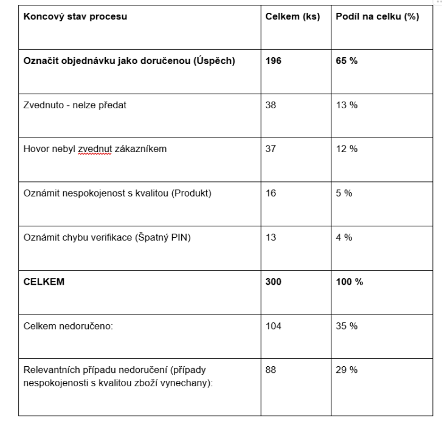
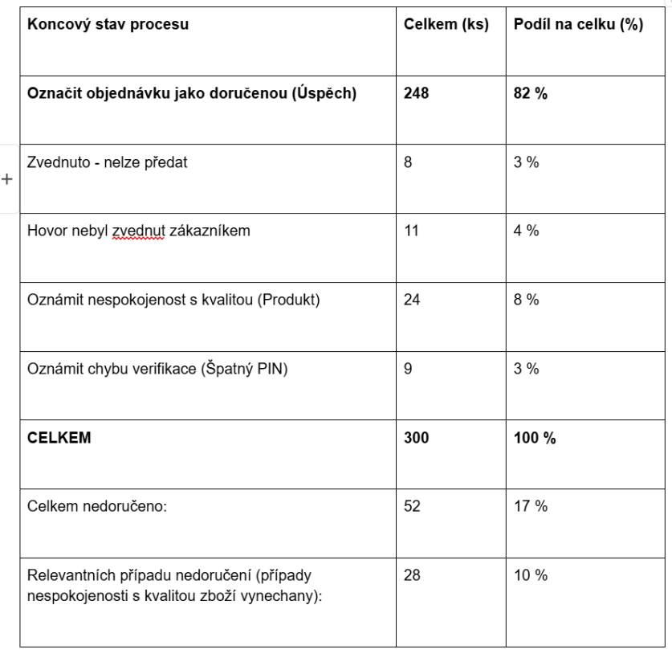

# Process-Management

This repository contains the complete analysis and simulation assets for the "White Lily" business process optimization project within **CTU FEE B6B16ISP – Business Process Management** university course. The contents include BPMN 2.0 diagrams, simulation environment files, and a comprehensive final report detailing the transition from the AS-IS state to the optimized TO-BE version of the process. The work targets the improvement of the delivery process within the "Bílá lilie" florist shop network in Prague. The tech stack features BPMN 2.0 modeling in Camunda Modeler and verification through the BIMP simulation engine.

---

## Project Description

Bílá Lilie is a medium-sized florist shop network based in Prague that specializes in bouquet sales through physical branches, a web platform, and phone orders. The company operates a specialized climate-controlled warehouse for flower storage and maintains its own fleet of courier vans for customer deliveries and branch replenishment. However, the processes within this infrastructure tend to be chaotic: the delivery process was identified as a critical bottleneck, with 35% of orders failing to reach the customer. These failures were caused by four specific issues: **unanswered courier calls, customer absence at the destination, PIN verification mistakes, and quality-related refusals.**

The TO-BE process was optimized by implementing a **customer app** designed to unify order data. Key features include **live tracking, push-notified status updates, the option of dynamic rescheduling for early-stage time shifts, and QR code handovers instead of manual PINs.** Our model showed that this digital transformation in fact resulted in a successful increase in the delivery success rate from **65%** to **82%**. The optimization also led to lower average process costs and faster cycle times, while preserving normal courier resource utilization. As per AS-IS and TO-BE simulation results contained in the final report:

<table border="0">
<tr>
<td align="center" width="50%"><b>AS-IS Simulation Results (Initial Process)</b></td>
<td align="center" width="50%"><b>TO-BE Simulation Results (Optimized Process)</b></td>
</tr>
<tr>
<td align="center"></td>
<td align="center"></td>
</tr>
<tr>
<td align="center"><i>Delivery Success Rate: 65%</i></td>
<td align="center"><i>Delivery Success Rate: 82%</i></td>
</tr>
</table>

> [!NOTE]
> *This project is based on an abstract business case that was created within this university course.*

> [!NOTE]
> *The Final-Report.pdf file provides comprehensive documentation of the entire research process. It includes detailed structural descriptions and BPMN
> 2.0 diagrams for both the AS-IS and TO-BE versions of the process. Furthermore, the report contains a thorough breakdown of all simulation parameters and
> results, offering a complete evaluation of the proposed optimizations.*

---

## Final Report Contents

1. Definition of Project Assignment and Goals
2. General Description of the Business Environment
3. Detailed Description of the AS-IS Delivery Process
4. BPMN 2.0 Diagram of the AS-IS State
5. AS-IS Simulation Methodology and Parameters
6. Key Findings and Statistical Overview of Results
7. Proposed Process Optimizations and Key Changes
8. BPMN 2.0 Diagram of the TO-BE State
9. Simulation Outputs of the TO-BE Model
10. Final Evaluation and Conclusion

---

## Technical Stack

BPMN 2.0 notation
Camunda Modeler
BIMP simulation engine

---

## Important Links

* [**Final Project Presentation**](https://prezi.com/p/ofwf8cssvori/prezentace-pro-kvetinarskou-sit-bila-lilie/?present=1) — A visual overview of the project results.
* [**High-Resolution AS-IS BPMN Diagram**](https://drive.google.com/file/d/19p1x15PQ5t7jqJAYxQ1lunP2cYf3c27a/view) — Detailed view of the AS-IS process diagram with zoom capability (Google Drive).
* [**High-Resolution TO-BE BPMN Diagram**](https://drive.google.com/file/d/1J2NPrXZfjF_tH71OxDWv2NO4tyNSQqC8/view) — Detailed view of the TO-BE process diagram with zoom capability (Google Drive).

---

## Author

**Ivan Shestachenko, 2026, B6B16ISP @ FEE CTU**
